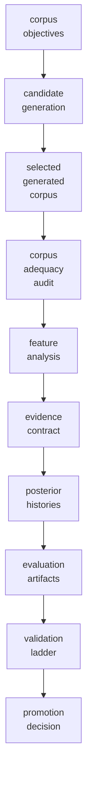

Artifact Graph
==============

The graph source is `artifacts/repo_story/artifact_graph.json`; rendered diagrams are:
- `artifacts/repo_story/repo_layer_diagram.png`
- `artifacts/repo_story/artifact_dependency_graph.png`

## Dependency Flow

## Manifest Dependencies

|Artifact|Depends on|
| :---: | :---: |
|`artifacts/corpus_objectives/objective_validation_report.md`|`experiments/corpus_objectives/common_1d_corpus_objectives.yaml`|
|`artifacts/candidate_generation/generated_candidates.csv`|`artifacts/corpus_objectives/objective_validation_report.md`|
|`artifacts/generic_corpus_exploration/candidate_scores.csv`|`artifacts/corpus_objectives/objective_validation_report.md`|
|`artifacts/generic_corpus_exploration/archive_coverage_heatmap.png`|`artifacts/generic_corpus_exploration/archive_cells.csv`|
|`artifacts/selected_generated_corpus/corpus_manifest.json`|`artifacts/generic_corpus_exploration/selected_corpus_manifest.json`|
|`artifacts/corpus_adequacy_audit_v1/corpus_adequacy_scorecard.csv`|`artifacts/common_1d_classifier_study/dataset_manifest.json`|
|`artifacts/corpus_adequacy_audit_v1/covariate_leakage_audit.csv`|`artifacts/common_1d_classifier_study/dataset_manifest.json`|
|`artifacts/class_validity/class_validity_scores.csv`|`artifacts/class_validity/class_definition_schema.json`|
|`artifacts/static_feature_class_prior_audit_v1/static_decision_card.md`|`artifacts/feature_analysis_v1/feature_matrix.csv`|
|`artifacts/static_feature_class_prior_audit_v1/prior_pathology_report.csv`|`artifacts/feature_analysis_v1/feature_matrix.csv`|
|`artifacts/packets/static_admissibility_mvp/decision_card.md`|`experiments/static_admissibility/common_1d_static_audit.yaml`|
|`artifacts/packets/static_admissibility_mvp/prior_pathology_report.csv`|`experiments/static_admissibility/common_1d_static_audit.yaml`|
|`artifacts/packets/static_admissibility_mvp/feature_synergy_candidates.csv`|`experiments/static_admissibility/common_1d_static_audit.yaml`|
|`artifacts/feature_analysis_v1/feature_separation_scores.csv`|`artifacts/feature_analysis_v1/feature_matrix.csv`|
|`artifacts/feature_analysis_v1/pairwise_auc_matrix.csv`|`artifacts/feature_analysis_v1/feature_matrix.csv`|
|`artifacts/feature_analysis_v1/pairwise_overlap_heatmap.png`|`artifacts/feature_analysis_v1/pairwise_overlap_matrix.csv`|
|`artifacts/prior_sensitivity_pointwise_v1/prior_sensitivity.csv`|`artifacts/pointwise_baseline/posterior_history.csv`|
|`artifacts/prior_sensitivity_windowed_robust_v1/prior_flip_thresholds.csv`|`artifacts/windowed_baseline/posterior_history.csv`|
|`artifacts/generic_inference_contract/evidence_provider_schema.json`|`artifacts/generic_inference_contract/classifier_output_schema.json`|
|`artifacts/classification_evidence_proof/evidence_provider_manifest.json`|`artifacts/generic_inference_contract/evidence_provider_schema.json`|
|`artifacts/common_1d_classifier_study/unified_posterior_history.csv`|`artifacts/common_1d_classifier_study/unified_likelihood_history.csv`|
|`artifacts/pointwise_baseline/pointwise_baseline_diagnostics.png`|`artifacts/pointwise_baseline/posterior_history.csv`|
|`artifacts/windowed_baseline/windowed_baseline_diagnostics.png`|`artifacts/windowed_baseline/feature_matrix.csv`|
|`artifacts/bayes_accumulator/bayes_accumulator_diagnostics.png`|`artifacts/bayes_accumulator/posterior_history.csv`|
|`artifacts/kalman_filter_bank/kalman_bank_diagnostics.png`|`artifacts/kalman_filter_bank/innovation_history.csv`|
|`artifacts/transition_matrix_accumulator_v1/transition_matrix_diagnostics.png`|`artifacts/transition_matrix_accumulator_v1/transition_matrix_posterior_history.csv`|
|`artifacts/advanced_filter_decision_v1/advanced_filter_decision_summary.json`|`artifacts/advanced_filter_decision_v1/advanced_filter_decision_evidence.json`|
|`artifacts/advanced_filter_comparison_v1/advanced_method_gate_matrix.csv`|`artifacts/advanced_filter_comparison_v1/method_comparison.csv`, `artifacts/advanced_filter_comparison_v1/advanced_filter_comparison_report.md`|
|`artifacts/filter_trace_validation_v1/filter_trace_validation_report.md`|`artifacts/filter_trace_validation_v1/method_trace_matrix.csv`, `artifacts/filter_trace_validation_v1/filter_step_trace_schema.json`|
|`artifacts/dimensional_lift_audit/module_dimension_status.csv`|`src/kinematic_classifier_sandbox`|
|`artifacts/validation_ladder/validation_ladder_decisions.csv`|`artifacts/validation_ladder/validation_ladder_scores.csv`|

## Reports And Their Tables

|Report|Primary tables / structured inputs|
| :---: | :---: |
|`artifacts/corpus_adequacy_audit_v1/corpus_adequacy_report.md`|corpus_adequacy_scorecard.csv, class_pair_coverage.csv, covariate_leakage_audit.csv, class_balance.csv|
|`artifacts/static_feature_class_prior_audit_v1/static_audit_report.md`|static_decision_card.md, class_confusability_matrix.csv, feature_relevance_table.csv, prior_pathology_report.csv|
|`artifacts/feature_analysis_v1/feature_analysis_report.md`|feature_separation_scores.csv, pairwise_auc_matrix.csv, pairwise_overlap_matrix.csv, identifiability_matrix.csv|
|`artifacts/prior_sensitivity_pointwise_v1/prior_sensitivity_report.md`|prior_sensitivity.csv, prior_flip_thresholds.csv, prior_dominance_metrics.json|
|`artifacts/generic_corpus_exploration/corpus_exploration_report.md`|candidate_scores.csv, archive_cells.csv, backend_comparison.csv, selected_corpus_manifest.json|
|`artifacts/kalman_filter_bank/kalman_bank_report.md`|innovation_history.csv, posterior_history.csv, confusion_final.csv, kalman_model_definitions.json|
|`artifacts/transition_matrix_accumulator_v1/transition_matrix_accumulator_report.md`|transition_matrix_scenario_summary.csv, transition_matrix_posterior_history.csv, transition_matrix_config.yaml|
|`artifacts/advanced_filter_decision_v1/advanced_filter_decision_report.md`|advanced_filter_decision_summary.json, advanced_filter_decision_evidence.json|
|`artifacts/advanced_filter_comparison_v1/advanced_filter_comparison_report.md`|advanced_method_gate_matrix.csv, method_comparison.csv, advanced_method_promotion_cards.md|
|`artifacts/filter_trace_validation_v1/filter_trace_validation_report.md`|method_trace_matrix.csv, trace_requirement_matrix.csv, filter_step_trace_schema.json|
|`artifacts/dimensional_lift_audit/dimensional_lift_audit.md`|module_dimension_status.csv, scalar_assumption_inventory.csv, validation_results.json|

## Plots Supporting Claims

|Claim|Plot|
| :---: | :---: |
|C01 Corpus quality is evaluated before classifier claims.|`plots/corpus_adequacy_scorecard.png`|
|C02 Feature/class separability can be inspected statically.|`plots/static_audit_decision_card.png`|
|C09 Study candidates are screened by static feature/class/prior admissibility before corpus search.|`02b_static_audit_decision_card.png`|
|C10 Prior regimes can make a feature/class setup pathological before classifier work.|`02g_prior_pathology_surface.png`|
|C11 Feature redundancy and candidate synergy can be identified before algorithm selection.|`02e_feature_redundancy_graph.png`|
|C03 Priors are explicitly tested for fragility.|`plots/prior_sensitivity.png`|
|C04 Classifier and filter rungs share a posterior/evidence contract.|`plots/pointwise_vs_accumulator_posterior_timelines.png`|
|C05 1D witness problems prove ladder layers.|`plots/pointwise_vs_accumulator_posterior_timelines.png`|
|C06 Corpus Explorer can generate and score candidate data.|`plots/candidate_corpus_comparison.png`|
|C07 Advanced filters are gated by demonstrated failure evidence and positive showcase witnesses.|`plots/advanced_filter_decision_matrix.png`|
|C08 3D transition is a controlled lift, not a full rewrite.|`plots/dimension_lift_audit_chart.png`|

The canonical machine-readable dependency set is generated from `kinematic_classifier_sandbox.repo_story.ARTIFACT_MANIFEST`.